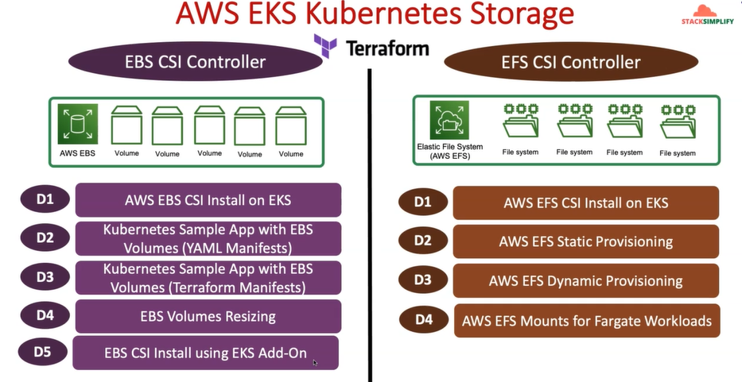
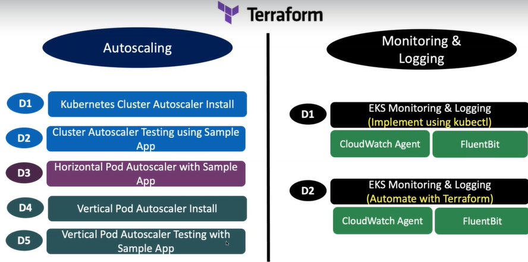

##### Teraform Fundamentals

Terraform is an open-source infrastructure as code software tool created by HashiCorp, enabling users to define and provision data center infrastructure using a high-level configuration language. It automates the process of setting up, managing, and scaling cloud resources across multiple service providers​

-[x] Flowcharts
- Terraform Fundamentals
- Kubernetes Fundaments
- AWS VPC 3-Tier Network
- EC2 Bastion Host in Public Subnets
- EKS Cluster (Public And Private Node Group)
- Kubernetes Development & Services using TF K8s Provider 
- Terraform Remote State Storage
- EKS IRSA (aws iam rOLES FOR K8S Service Accounts)
- Kubernets Storage : ebs csi
- kubernets Storage : EFS CSI
- EKS Load Balancer Controller Ingress
- EKS IAM EKS Fragate
- Autoscaling
- EKS Monitoring and Logging
  
### EBS CSI (Container Storage Interface) Controllers manage the provisioning and lifecycle of Amazon Elastic Block Store (EBS) volumes for Kubernetes clusters, providing persistent storage for pods. EFS CSI Controllers, on the other hand, handle the integration of Amazon Elastic File System (EFS) with Kubernetes, allowing dynamic provisioning of shared, scalable file storage accessible by multiple pods simultaneously.

#### AWS EKS Load Balancer 
##### Terraform
- AWS Load Balancer Controller
- AWS Application Load Balancer
- Kubernetes Ingress Service
- Terraform Kubernetes Provide

 

## Terraform Workflow
- init                      [terraform init]
- validate                  [terraform validate]
- plan                      [terraform plan]
- apply                     [terraform apply]
- destroy                   [terraform destroy]

- [x] Used to initialize a working directory containing      - terraform config files
- This is the first command that should be run after writing a - new terraform configuration
- download providers

- [x] Validate the terraform configurations file in the respective directory to ensure they are syntactically valid and internally consistent.

- [x] Creates an execute plan 
terraform performs a refresh and determines what axtions are necessary to achive the desired state specified in configuration files

- [x] Used to apply the changes required to reach the desired state of the configuration.
By default, apply scan s the current directory for the configuration and applies the changes appropriately 

- [x] Used to destroy the terraform managed infrastructure
this will ask for confirmation before destroying
